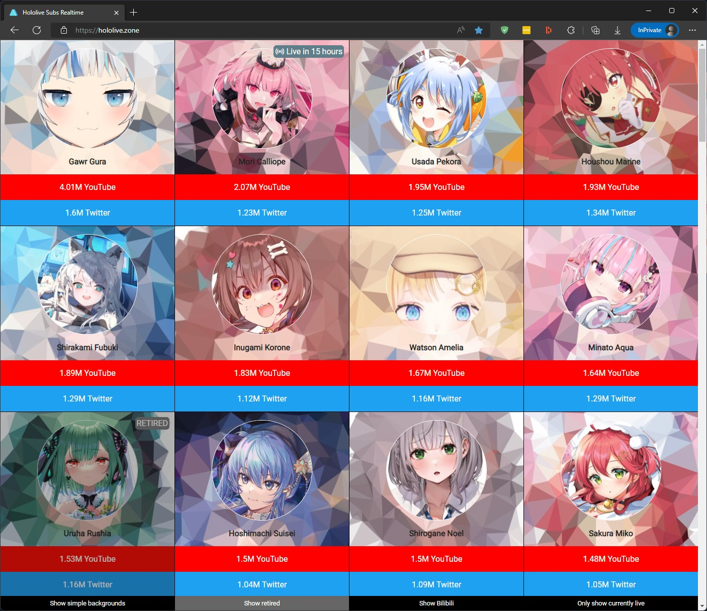

============
HololiveSubs
============

Website which automatically tracks YouTube, Twitter and Bilibili Subscriber counts of all Hololive VTubers and orders them according to YouTubes sub count.

https://hololive.zone/

Cronjobs
========

To make this webpage actually work it of course has to get the data every now and then. For this we can create some cron jobs:

.. code-block:: sh

  */30 * * * * cd /path/to/holozone && python get_stat.py 2>&1 | /usr/bin/logger -t holozone       # Get subscriber + live events stats every 30 minutes
  */15 * * * * cd /path/to/holozone && python get_stat.py live 2>&1 | /usr/bin/logger -t holozone  # Get live events stats every 15 minutes
  */15 * * * * cd /path/to/holozone && python create_events.py 2>&1 | /usr/bin/logger -t holozone  # Update calendar ICS files every 15 minutes
  0 0 * * * cp /path/to/holozone/www/{stats.json,archive/stats-$(date -I).json}                    # Copy the stats.json to archive/stats-yyyy-mm-dd.json at 00:00 of each day.

